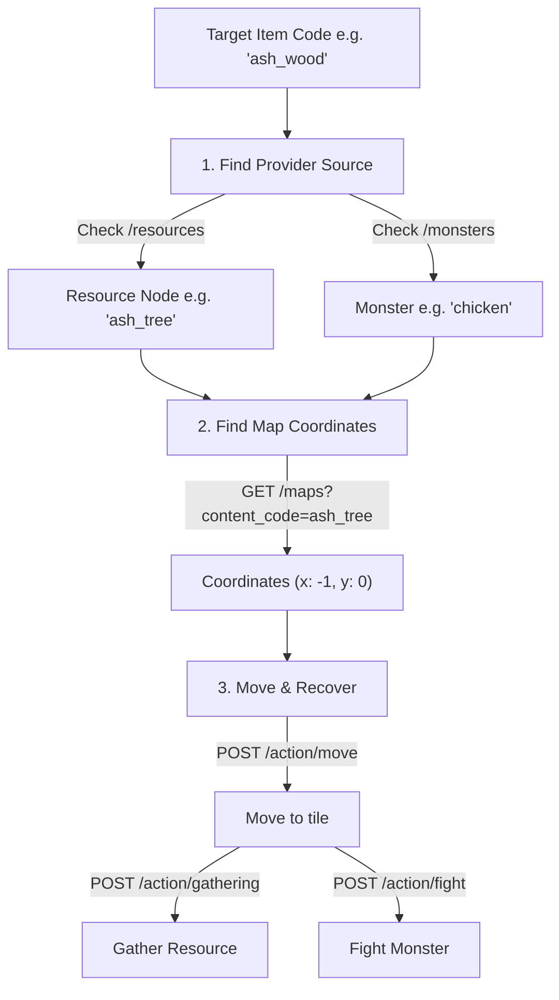
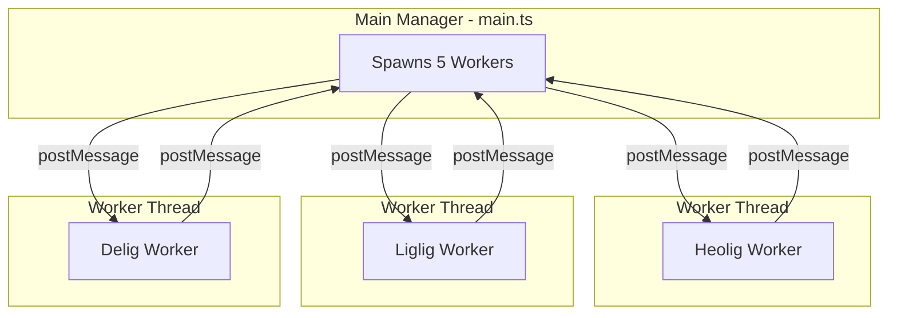

# ArtifactsMMO

...

## Running the Project

```bash
deno --env-file --allow-env --allow-net Client/main.ts
```

## Searching resources


```mermaid
flowchart TD
    Target[Target Item Code e.g. 'ash_wood'] --> Step1[1. Find Provider Source]
    Step1 -->|Check /resources| Resource[Resource Node e.g. 'ash_tree']
    Step1 -->|Check /monsters| Monster[Monster e.g. 'chicken']

    Resource --> Step2[2. Find Map Coordinates]
    Monster --> Step2

    Step2 -->|GET /maps?content_code=ash_tree| MapCoords["Coordinates (x: -1, y: 0)"]

    MapCoords --> Step3[3. Move & Recover]
    Step3 -->|POST /action/move| Move[Move to tile]
    Move -->|POST /action/gathering| Gather[Gather Resource]
    Move -->|POST /action/fight| Fight[Fight Monster]
```

## Workers


```mermaid
flowchart TD
        subgraph Main Thread [Main Manager - main.ts]
            Manager[Spawns 5 Workers]

        end
        Manager -->|postMessage| W1
        Manager -->|postMessage| W2
        Manager -->|postMessage| W3

        subgraph Thread1["Worker Thread"]
            W1[Heolig Worker] -->|postMessage| Manager
        end

        subgraph Thread2["Worker Thread"]
            W2[Liglig Worker] -->|postMessage| Manager
        end

        subgraph Thread3["Worker Thread"]
            W3[Delig Worker] -->|postMessage| Manager
        end
```
